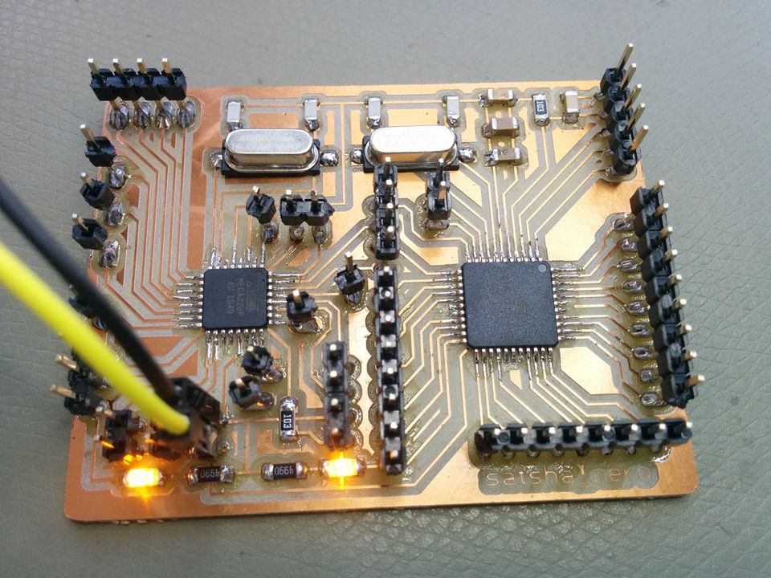
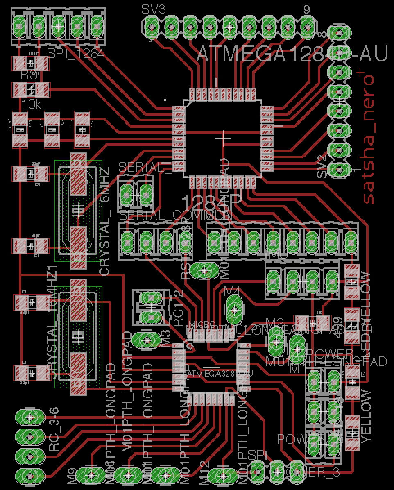
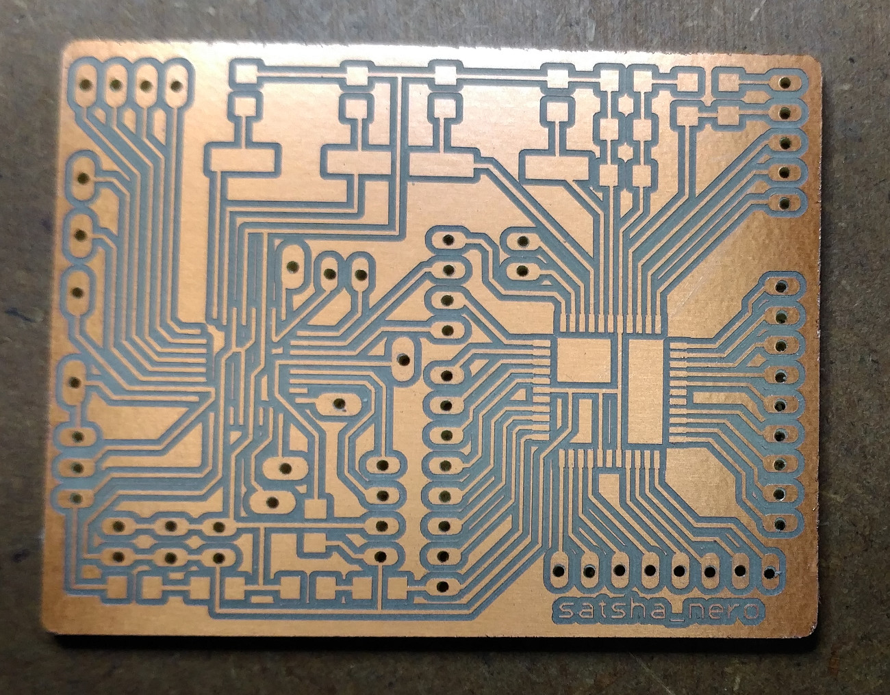
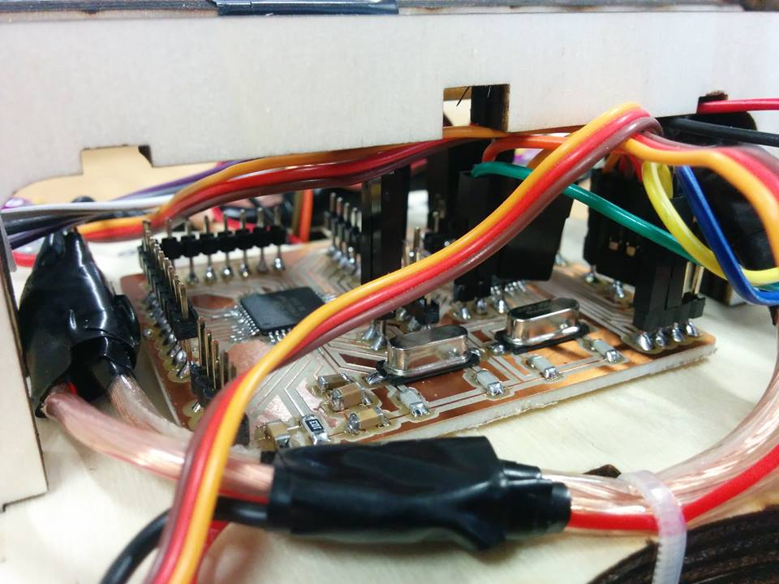
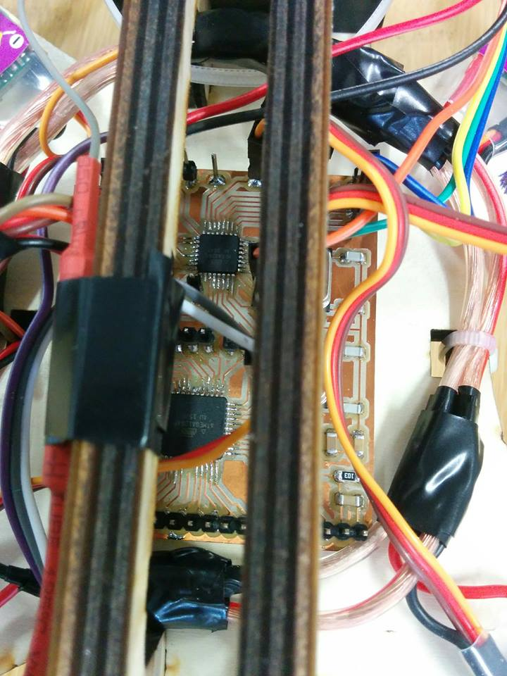

<h1 style="font-family: courier;" align="center"> satshakit nero</h1>

<i>An improved & fabbable multi-mcu flight controller board.</i>

  

What is satshakit?
--

satshakit is a **Arduino IDE  and libraries compatible**, fabbable and open source board.

Here you can find all of the satshakit boards: **[satshakit organization](https://github.com/satshakit)**.

satshakit-nero
--

**satshakit nero** is microcontroller board designed around the **ATMega1284P** and the **ATMega328P** chips and it is suitable for advanced drone applications and scenarios in which is needed to have two available microcontrollers. The ATMega328P manages the flight with the **[Multiwii](http://www.multiwii.com/)** while ATMega1284P can be used to inject and override the transmitter stick values (ROLL, PITCH, YAW and THROTTLE) or to manage a set of additional sensors. In the board there is a jumper to enable or disable the serial communication between the two microcontrollers. 

Here you can have a look on **satshakit-nero board**:

And here you can see the **satshakit-nero pinout**:

**downloads (right click, download as)**

- [satshakit-nero eagle schematic](https://raw.githubusercontent.com/satshakit/satshakit-nero/master/eagle/satshakit-nero/satshakit-nero.sch)
- [satshakit-nero eagle board](https://raw.githubusercontent.com/satshakit/satshakit-nero/master/eagle/satshakit-nero/satshakit-nero.brd)
- [satshakit-nero inside cut png](https://raw.githubusercontent.com/satshakit/satshakit-nero/master/media/satshakit-nero-inside.png)
- [satshakit-nero outsite cut png](https://raw.githubusercontent.com/satshakit/satshakit-nero/master/media/satshakit-nero-outside.png)

**media**

satshakit-nero flying test:

Authors
--

- Daniele Ingrassia

Contact
--

- **ingrassiada@gmail.com**
- **[linkedin](http://it.linkedin.com/in/danieleingrassia)**

Thanks
--

[Aldo Sollazzo and Noumena.io](http://noumena.io/)

[Fablab Kamp-Lintfort](http://fablab.hochschule-rhein-waal.de/index.php/de/) 
Hochschule Rhein-Waal 
Friedrich-Heinrich-Allee 25, 47475 Kamp-Lintfort, Germany 
fablab@hochschule-rhein-waal.de

License
--
This work is licensed under the terms of Attribution-NonCommercial-ShareAlike 4.0 International ([CC BY-NC-SA 4.0](https://creativecommons.org/licenses/by-nc-sa/4.0/)).

Disclaimer  
--

This hardware/software is provided "as is", and you use the hardware/software at your own risk. Under no circumstances shall any author be liable for direct, indirect, special, incidental, or consequential damages resulting from the use, misuse, or inability to use this hardware/software, even if the authors have been advised of the possibility of such damages.

